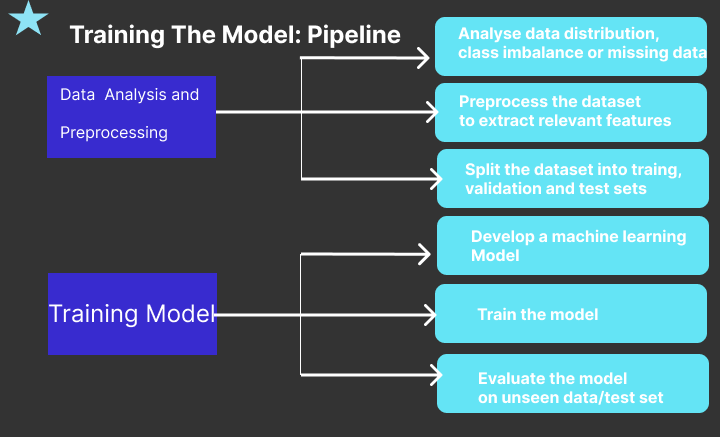

# Hackathon-competition

<h2 style="color:orange">Resume Screening hackathon competition</h2>

# Problem Statement

Design a system using Tensorflow that classifies a resume based on its potential fit for different job categories.

# Motivations of the Project
 
1. Create a faster system for classifying resumes.
2. Reduce human effort for recruiters.
3. Help applicants to improve their resumes before applying to jobs
4. Improve current resume classification systems, which have limitations
  - Can only be used by companies, not available for applicants to get feedback
  - Many don’t use machine learning, which makes making changes, like adding more job categories and retraining the classifiers difficult to do

# Overview of Solution

1) Classify resumes into categories, Data scientist, Data Analyst, Machine learning engineer, Java Developer, Web developer, Database Management, etc.
2) Use a data set which has many job categories.
3) Solution includes a machine learning model to classify resume categories
     Model takes the text in the resume and classifies it into one of the categories.
     Depicts confidence in the category choice(as a percentage) 
4) Display the top five categories and confidence percentages.
5) Deploy trained model on the https server(most probably on the browser)
6) Test on team mate’s resume (show later in demo)

# Training The Model: Pipeline

